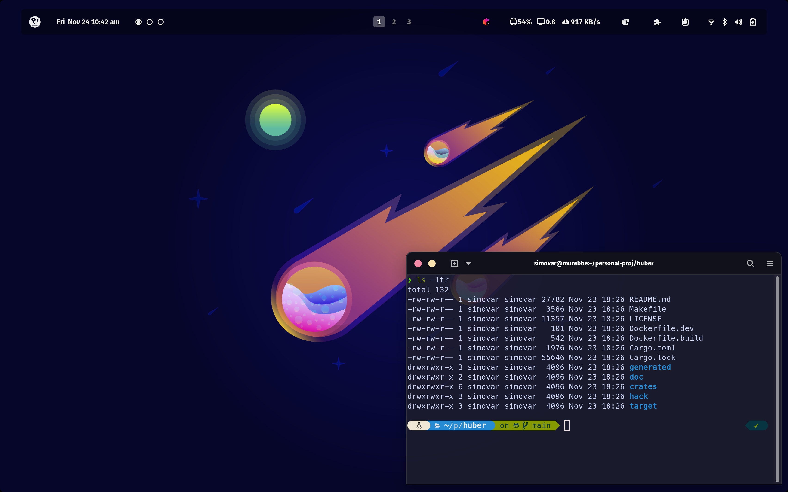
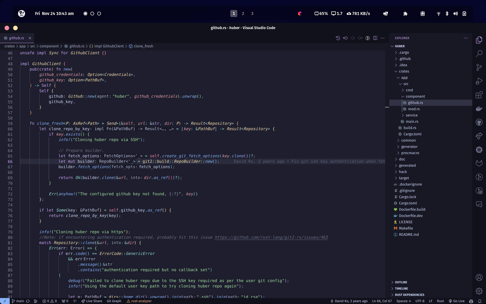
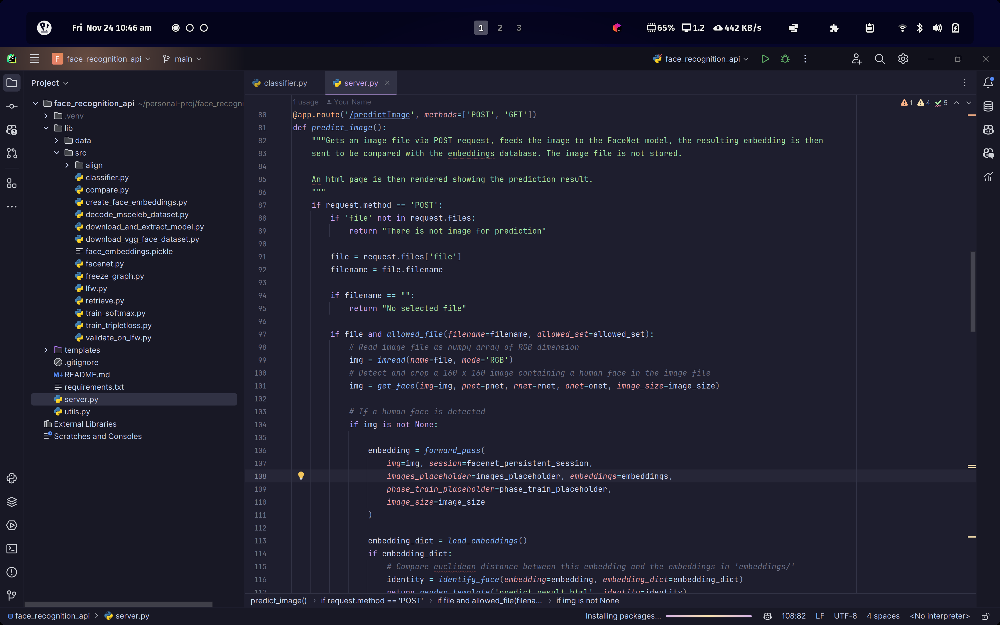
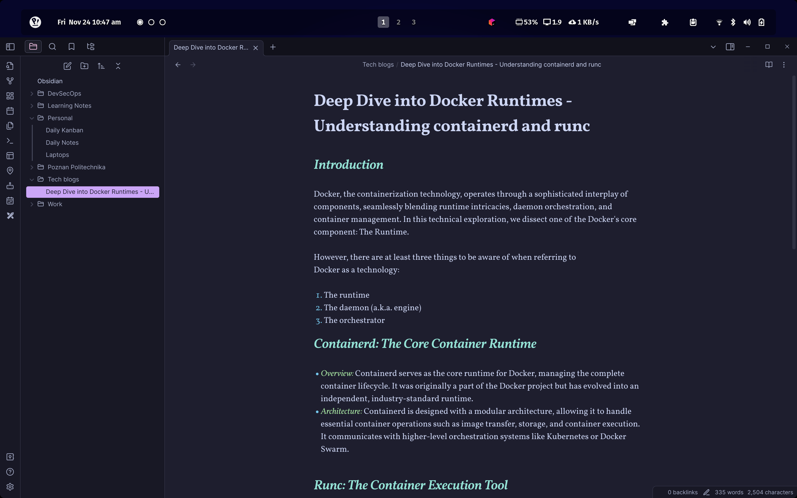

# Personalization - Linux Rice | Obsidian | Visual Studio Code

## Screenshots

## ***.themes/***

I'm personally using ***Catppuccin Mocha Standart*** theme and customized top bar enriched with gnome extensions

## ***.config/***

Config folder includes assets of ***Catppuccin*** theme

## ***extensions/***

It includes gnome-extensions that I'm using for my daily use of Pop_OS:

- User Theme
- Dash to Dock
- Pano Clipboard
- Coverflow Alt+Tab
- Transparent Top Bar
- Rounded Corners
- Compiz Windows Effect
- Logo Menu
- Space Bar
- Aylur's Widgets
- Extensions List

## ***wallpapers/***

I also created folder for interesting wallpapers that I saved

## ***Terminal***

I'm using ZSH for my daily user shell. As for scripting I'm still using Bash and I think it's the best one to use for shell scripting or linux automation.

For best powerlevel10k theme experience, we have to install MesloLGS Regular font:
- https://github.com/romkatv/powerlevel10k/blob/master/font.md

As for gnome-terminal, I'm also using Catppuccin theme where you can also install from:
- https://github.com/catppuccin/gnome-terminal

Best way to setup zsh, oh-my-zsh, powerlevel10k, and basic plugins:
- https://medium.com/@satriajanaka09/setup-zsh-oh-my-zsh-powerlevel10k-on-ubuntu-20-04-c4a4052508fd

## ***Obsidian***

I'm trying to plan and note everything I'm doing on Obsidian. These are the things I'm using Obsidian for:

- Taking daily notes
- Adding tasks to daily kanban board
- Taking notes on my learning, self-development, and technologies
- Work folder mostly taking notes on documentation of work projects
- Specific folder for writing tech blogs: Golang, Python, AI, DevOps, SRE, and etc.
- University lecture/class/lab notes on one folder

***Themes***: Tokyo Night or Catppuccin

## ***Jetbrains***

These are the ***JetBrains IDEs*** I'm using:
- ***RustRover*** - Rust projects
- ***PyCharm Professional*** - Mostly using Visual Studio Code for Python Development, but sometimes it's more easy to use.
- ***GoLand*** - Using for Golang projects. Only IDE I'm using for Go.

***Themes***: GitHub Theme or Catppuccin Mocha

## ***Visual Studio Code***

For Python development I'm mostly using VSCode, and these are the extensions that I'm using:

- Docker
- Git Graph
- Git History
- GitLens
- GitHub Copilot
- GitHub Copilot Chat
- Gitignore
- GitLab Workflow
- Go
- Jupyter
- Jupyter Cell Tags
- Jupyter Keymap
- Kubernetes YAML Formatter
- Live Share
- YAML
- Python
- Pylance

***Themes:*** Catppuccin for VSCode or GitHub Theme
